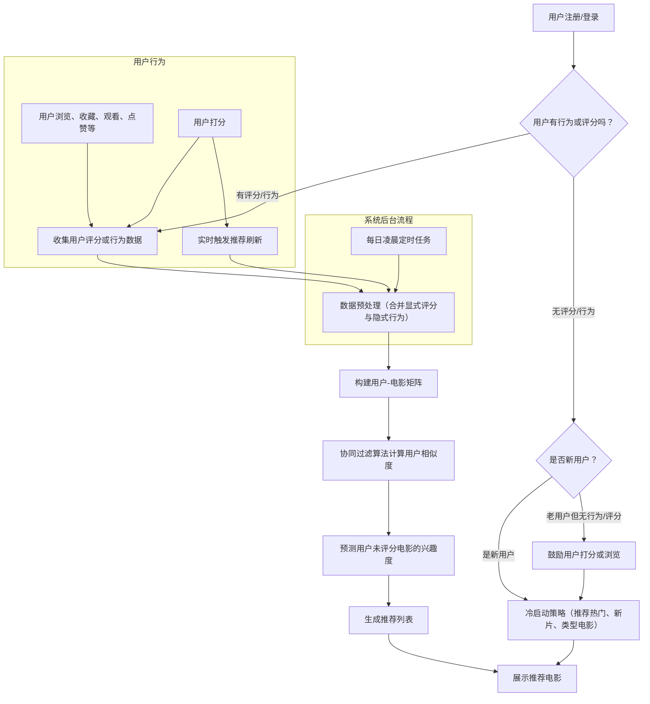

# 电影推荐系统流程策略图

---

## 说明

- **用户行为**：打分、浏览、收藏等都会被系统记录，作为协同过滤的“显式”或“隐式”评分。
- **冷启动**：新用户或无行为/评分用户，推荐热门电影、新片或类型匹配电影。
- **定时任务**：每天凌晨批量为所有用户刷新推荐列表。
- **实时任务**：用户有新评分或明显行为时，实时刷新其推荐列表。
- **核心算法**：以用户-物品矩阵为基础，结合用户相似度进行协同过滤推荐。